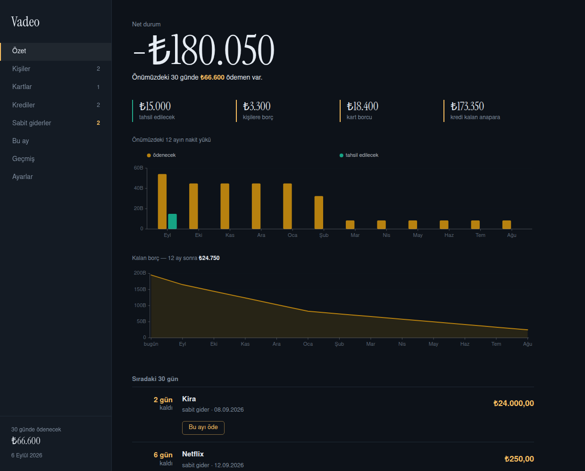
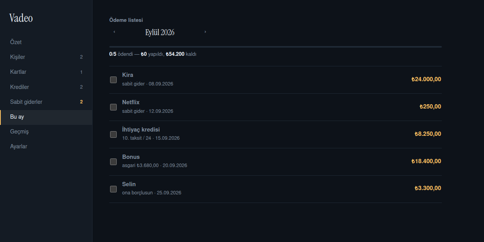

# Vadeo

[](https://github.com/Gorke07/Vadeo/actions/workflows/ci.yml)

Borç, alacak, kredi kartı ekstresi, kredi taksiti ve sabit gider takibi.
Tek soruyu cevaplamak için yazıldı: **ne zaman, ne kadar ödemem gerekiyor?**

Harici build aracı yok. Yalnızca Bun'ın yerleşik yetenekleri kullanılıyor:
`Bun.serve` (HTTP), `bun:sqlite` (veritabanı), `Bun.build` (frontend derleme).



## Çalıştırma

Gereken tek şey [Bun](https://bun.sh) (1.4+).

```sh
bun install
bun run dev        # http://localhost:2340
```

`bun run dev` açılışta frontend'i derler, sunucuyu başlatır ve dosya değişince
yeniden derler. Üretim için `bun start`.

Veritabanı yoksa ilk açılışta oluşturulur; depoya girmez.

### Docker

Sürekli ayakta kalması için:

```sh
docker compose up -d          # http://localhost:2340
```

Kaynağı klonlamadan çalıştırmak istersen hazır imaj var (amd64 + arm64):

```sh
docker run -d --name vadeo --restart unless-stopped \
  -p 127.0.0.1:2340:2340 -v ./data:/data \
  ghcr.io/gorke07/vadeo:latest
```

Makine açıldığında kendiliğinden gelir, çökerse yeniden başlar. Veritabanı
host'taki `./data/` dizininde yaşar; container silinse de kalır. Sağlık kontrolü
takılan süreci yakalar.

Port yalnızca `127.0.0.1`'e bağlıdır — dışarıdan erişilmez. Telefondan kullanmak
istersen `compose.yml`'de `"2340:2340"` yap, **ama önce Ayarlar'dan PIN kur**.
2340 doluysa `VADEO_PORT=2341 docker compose up -d`.

`./data` yerel diskte olmalı: SQLite'ın WAL kipi ağ dosya sisteminde (NFS/SMB)
bozulur.

### Unraid

Hazır şablon: [`unraid/vadeo.xml`](unraid/vadeo.xml). Unraid'de
`/boot/config/plugins/dockerMan/templates-user/` altına kopyala; Docker sekmesinde
**Add Container → Template** listesinde çıkar. Elle de kurabilirsin, üç ayrıntı önemli:

- **`--user 99:100`** (Extra Parameters). Unraid appdata dizinlerini `nobody:users`
  sahipliğinde tutar. İmaj çalışma anında kendi dizinine yazmaz — frontend imaj
  kurulurken derlenir — bu yüzden herhangi bir uid ile koşabilir.
- **Veri yolu**: `/data` hedefine appdata dizinini bağla. appdata paylaşımın
  cache havuzundaysa **doğrudan havuz yolunu ver** (`/mnt/cache/appdata/vadeo`),
  `/mnt/user/...` değil: Mover açık bir SQLite dosyasını taşımasın ve FUSE
  katmanı aradan çıksın.
- **PIN kur.** Unraid'de container ağa açık olur; ilk açılışta
  Ayarlar → Erişim'den PIN belirle. Ev ağının dışına açacaksan önüne TLS sonlandıran
  bir ters vekil koy.

## Ortam değişkenleri

Hiçbiri zorunlu değil. Proje kökündeki `.env` dosyasını Bun kendisi okur.

| Değişken | Varsayılan | Ne işe yarar |
|---|---|---|
| `PORT` | `2340` | Dinlenen port |
| `VADEO_DB` | `db.sqlite` | Veritabanı dosyası |
| `TELEGRAM_BOT_TOKEN` | — | Bildirim için; Ayarlar'dan da girilebilir |
| `TELEGRAM_CHAT_ID` | — | Aynı |
| `VADEO_NOTIFY_HOURS` | `9-22` | Bildirimin sessiz kalmadığı saat aralığı |

Telegram ayarları Ayarlar sayfasından da girilebilir; oradan girilirse veritabanında
saklanır ve `.env` gerekmez.

## Ne yapar

**Kayıtlar.** Kişisel borç ve alacak (kısmi ödeme dahil), kredi kartı ekstresi
(asgari / kısmi / tam ödeme), kredi taksitleri, sabit giderler. Sabit giderin
**sözleşme bitiş tarihi** var: projeksiyon o tarihten sonrasını uydurmaz.

**Aylık ödeme listesi.** O ayın ödenecekleri ve ödenmişleri tek listede. Kutuyu
işaretlemek ödemeyi işler, işareti kaldırmak geri alır. Geçmiş aylardan sarkan
ödenmemişler de içinde bulunulan ayda görünür.



**Projeksiyon.** 12 aylık nakit yükü ve borç erime eğrisi. Erime eğrisine sabit
giderler dahil değildir: onlar borç değil sürekli akıştır, dahil edilse eğri hiç
sıfıra inmez ve grafik yalan söyler.

**Bildirim.** Telegram üzerinden; dört tetik ayrı ayrı kapatılabilir — bugün/yarın
vadesi gelenler, yeni oluşan gecikme, girilmemiş kart ekstresi, yaklaşan sözleşme
yenilenmesi. Sistemde cron veya servis kurmaz: zaten çalışan sunucu saatte bir
bakar. Aynı olay iki kez gönderilmez. Yeni olay yoksa mesaj atmaz.

**Geri alma.** Her ödeme, bozduğu alanların önceki değerlerini saklar; geri alma
onları aynen geri yazar — tersine hesapla tahmin etmez.

**Yedek.** Ayarlar'dan tek dosya indirilir ve aynı yerden geri yüklenir. Geri
yükleme tek transaction içinde yapılır; dosya doğrulanamazsa mevcut veriye
dokunulmaz. Yedekten gelen PIN uygulanmaz, yoksa eski bir yedek seni kendi
uygulamandan kilitleyebilirdi.

**PWA.** Ana ekrana kurulur, sunucuya ulaşılamadığında kabuk yine açılır ve
sebebini söyler. Mali veri asla önbelleğe alınmaz — bayat bakiye yanlış karar
verdirir.

## Güvenlik

Ayarlar'dan **PIN** kurulabilir. PIN `argon2id` ile saklanır ve asıl koruma
**artan bekleme süresidir**: 4 haneli bir PIN'de 10.000 ihtimal var, yavaş hash
tek başına yetmez. 5. hatalı denemeden sonra kilit devreye girer ve süre her
denemede ikiye katlanır (1 → 2 → 4 → … → 60 dk).

Yedek indirme dahil bütün API uçları korumalıdır — o dosya veritabanının tamamıdır.

**Bilinen sınır:** uygulama düz HTTP üzerinden çalışır. PIN, sunucuya ulaşan birinin
veriyi okumasını engeller; ancak aynı ağı dinleyen biri hem veriyi hem oturum
çerezini görebilir. Ev ağının dışına açacaksan TLS gerekir.

## Yapı

```
src/
├── index.ts              Bun.serve; statik dosyalar ve saatlik bildirim
├── build.ts              Frontend derlemesi (geliştirmede açılışta, imajda kurulurken)
├── shared.ts             Tarih, para, projeksiyon ve aylık liste hesapları (iki taraf da kullanır)
├── notify.ts             Telegram: olay toplama, kuyruk, gönderim
├── backend/
│   ├── db.ts             Şema ve tipler
│   ├── settings.ts       Anahtar/değer ayar deposu
│   ├── auth.ts           PIN, oturum, kilitlenme
│   └── routes.ts         REST uçları ve girdi doğrulama
└── frontend/
    ├── index.html        Kabuk, tasarım belirteçleri, tüm CSS
    ├── index.tsx         Mount + service worker kaydı
    ├── App.tsx           Yönlendirme, görünümler, grafikler
    └── assets/           Manifest, ikonlar, service worker
```

## Test

```sh
bun test        # 36 test
```

CI her push'ta testleri İstanbul saat diliminde çalıştırır (tarih hesapları yerele
bağlı), geçerse imajı `ghcr.io/gorke07/vadeo` altına basar. Testler geçmeden imaj
yayınlanmaz.

Testler para ve tarih yollarını kovalar: kısmi ödemenin kalanı aşamaması, geri
almanın kırpılmış asgariyi geri getirmesi, sözleşme bitince projeksiyonun durması,
PIN kilidinin katlanarak uzaması, yedeğin aynen geri gelmesi ve bozuk dosyanın
veriye dokunmaması.

## Kararlar

**Tarihler yerel saatten türer.** UTC kullanmak Türkiye'de gece 00:00–03:00 arasında
tüm geri sayımları bir gün geriye kaydırıyordu. `today` sabit değil fonksiyondur;
sunucu günlerce ayakta kalır ve gece yarısını geçebilmelidir.

**Para `REAL` olarak tutulur**, her yazımda iki haneye yuvarlanır. Kişisel takip
ölçeğinde yeterli; kuruş hassasiyeti gerekirse `INTEGER` kuruşa geçilmeli.

**Kredinin kalan anaparası** = kalan taksit × taksit tutarı. Faiz/anapara
ayrıştırması yapılmaz.

## Lisans

MIT
